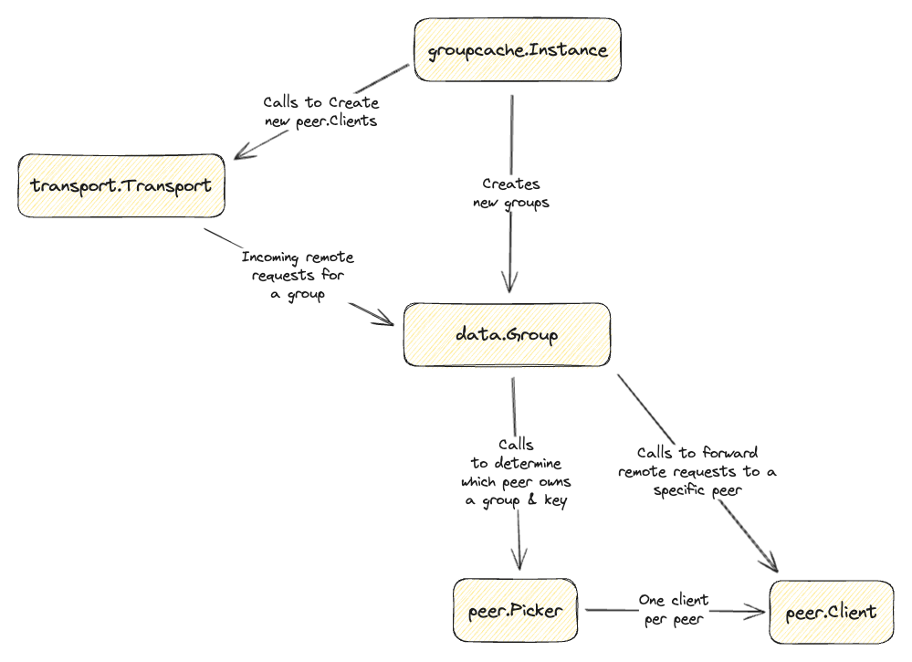

# groupcache

groupcache is a caching and cache-filling library, intended as a
replacement for memcached in many cases.

For API docs and examples, see http://godoc.org/github.com/groupcache/groupcache-go/v3
   

## Comparing Groupcache to memcached

### **Like memcached**, groupcache:

 * shards by key to select which peer is responsible for that key

### **Unlike memcached**, groupcache:

 * does not require running a separate set of servers, thus massively
   reducing deployment/configuration pain.  groupcache is a client
   library as well as a server.  It connects to its own peers.

 * comes with a cache filling mechanism.  Whereas memcached just says
   "Sorry, cache miss", often resulting in a thundering herd of
   database (or whatever) loads from an unbounded number of clients
   (which has resulted in several fun outages), groupcache coordinates
   cache fills such that only one load in one process of an entire
   replicated set of processes populates the cache, then multiplexes
   the loaded value to all callers.

 * does not support versioned values.  If key "foo" is value "bar",
   key "foo" must always be "bar".

## Loading process

In a nutshell, a groupcache lookup of **Get("foo")** looks like:

(On machine #5 of a set of N machines running the same code)

 1. Is the value of "foo" in local memory because it's super hot?  If so, use it.

 2. Is the value of "foo" in local memory because peer #5 (the current
    peer) is the owner of it?  If so, use it.

 3. Amongst all the peers in my set of N, am I the owner of the key
    "foo"?  (e.g. does it consistent hash to 5?)  If so, load it and 
    store in the local cache..  If other callers come in, via the same 
    process or via RPC requests from peers, they block waiting for the load 
    to finish and get the same answer.  If not, RPC to the peer that's the 
    owner and get the answer.  If the RPC fails, just load it locally (still with
    local dup suppression).

## Example

```go
import (
    "context"
    "fmt"
    "log"
    "time"
    "log/slog"

    "github.com/groupcache/groupcache-go/v3"
    "github.com/groupcache/groupcache-go/v3/transport"
    "github.com/groupcache/groupcache-go/v3/transport/peer"
)

func ExampleUsage() {
    ctx, cancel := context.WithTimeout(context.Background(), time.Second*10)
    defer cancel()

    // SpawnDaemon is a convenience function which Starts an instance of groupcache 
    // with the provided transport and listens for groupcache HTTP requests on the address provided.
    d, err := groupcache.SpawnDaemon(ctx, "192.168.1.1:8080", groupcache.Options{})
    if err != nil {
        log.Fatal("while starting server on 192.168.1.1:8080")
    }

    // Manually set peers, or use some discovery system to identify peers.
    // It is safe to call SetPeers() whenever the peer topology changes
    d.SetPeers(ctx, []peer.Info{
        {
            Address: "192.168.1.1:8080",
            IsSelf:  true,
        },
        {
            Address: "192.168.1.1:8081",
            IsSelf:  false,
        },
        {
            Address: "192.168.1.1:8082",
            IsSelf:  false,
        },
    })

    // Create a new group cache with a max cache size of 3MB
    group, err := d.NewGroup("users", 3000000, groupcache.GetterFunc(
        func(ctx context.Context, id string, dest transport.Sink) error {
            // In a real scenario we might fetch the value from a database.
            /*if user, err := fetchUserFromMongo(ctx, id); err != nil {
                return err
            }*/

            user := User{
                Id:      "12345",
                Name:    "John Doe",
                Age:     40,
            }

            // Set the user in the groupcache to expire after 5 minutes
            if err := dest.SetProto(&user, time.Now().Add(time.Minute*5)); err != nil {
                return err
            }
            return nil
        },
    ))
    if err != nil {
        log.Fatal(err)
    }

    ctx, cancel = context.WithTimeout(context.Background(), time.Second)
    defer cancel()

    var user User
    if err := group.Get(ctx, "12345", transport.ProtoSink(&user)); err != nil {
        log.Fatal(err)
    }

    fmt.Printf("-- User --\n")
    fmt.Printf("Id: %s\n", user.Id)
    fmt.Printf("Name: %s\n", user.Name)
    fmt.Printf("Age: %d\n", user.Age)

    // Remove the key from the groupcache
    if err := group.Remove(ctx, "12345"); err != nil {
        log.Fatal(err)
    }

    // Shutdown the instance and HTTP listeners
    d.Shutdown(ctx)
}
```

# HTTP integration
This is a quick guide on how to use groupcache in a service that is already listening for HTTP requests. In some
circumstances you may want to have groupcache respond using the same HTTP port that non groupcache requests are
received through. In this case you must explicitly create the `transport.HttpTransport` which can then be passed
to your HTTP router/handler.

```go
func main() {
    mux := http.NewServeMux()

    // Add endpoints specific to our application
    mux.HandleFunc("/index", func(w http.ResponseWriter, r *http.Request) {
        fmt.Fprintf(w, "Hello, this is a non groupcache handler")
    })

    // Explicitly instantiate and use the HTTP transport
    t := transport.NewHttpTransport(
        transport.HttpTransportOptions{
        // BasePath specifies the HTTP path that will serve groupcache requests.
        // If blank, it defaults to "/_groupcache/".
        BasePath: "/_groupcache/",
        // Context optionally specifies a context for the server to use when it
        // receives a request.
        Context: nil,
        // Client optionally provide a custom http client with TLS config
        Client: nil,
        // Scheme is is either `http` or `https` defaults to `http`
        Scheme: "http",
        },
    )

    // Create a new groupcache instance
    instance := groupcache.New(groupcache.Options{
        // All of these fields are optional
        HashFn:    fnv1.HashBytes64,
        Logger:    slog.Default(),
        Transport: t,
        Replicas:  50,
    })

    // Add the groupcache handler
    mux.Handle("/_groupcache/", t)

    server := http.Server{
        Addr:    "192.168.1.1:8080",
        Handler: mux,
    }

    // Start a HTTP server to listen for peer requests from the groupcache
    go func() {
        log.Printf("Serving....\n")
        if err := server.ListenAndServe(); err != nil {
            log.Fatal(err)
        }
    }()
    defer func() { _ = server.Shutdown(context.Background()) }()
}
```

### Modifications from original library
The original author of groupcache is [Brad Fitzpatrick](https://github.com/bradfitz) who is also the
author of [memcached](https://memcached.org/). The original code repository for groupcache can be 
found [here](https://github.com/golang/groupcache) and appears to be abandoned. We have taken the liberty 
of modifying the library with additional features and fixing some deficiencies.

* Support for explicit key removal from a group. `Remove()` requests are
  first sent to the peer who owns the key, then the remove request is
  forwarded to every peer in the groupcache. NOTE: This is a best case design
  since it is possible a temporary network disruption could occur resulting
  in remove requests never making it their peers. In practice this scenario
  is very rare and the system remains very consistent. In case of an
  inconsistency placing a expiration time on your values will ensure the
  cluster eventually becomes consistent again.
* Support for expired values. `SetBytes()`, `SetProto()` and `SetString()` now
  accept an optional `time.Time` which represents a time in the future when the
  value will expire. If you don't want expiration, pass the zero value for
  `time.Time` (for instance, `time.Time{}`). Expiration is handled by the LRU Cache
  when a `Get()` on a key is requested. This means no network coordination of
  expired values is needed. However, this DOES require that the clock on all nodes in the
  cluster are synchronized for consistent expiration of values.
* Now always populating the hotcache. A more complex algorithm is unnecessary
  when the LRU cache will ensure the most used values remain in the cache. The
  evict code ensures the hotcache never overcrowds the maincache.
* Removed global state present in the original library to allow multiple groupcache
  instances to exist in code simultaneously.
* Separated the HTTP transport code from the rest of the code base such that third-party
  transports can be used without needing access to the internals of the library.
* Updated dependencies and use modern golang programming and documentation practices
* Added support for optional internal cache implementations.

# Source Code Internals
If you are reading this, you are likely in front of a Github page and are interested in building a custom transport
or creating a Pull Request. In which case, the following explains the most of the important structs and how they 
interact with each other.

### groupcache.Instance
Represents an instance of groupcache. With the instance, you can create new groups and add other instances to your 
cluster by calling `Instance.SetPeers()`. Each instance communicates with other peers through the transport that is passed in
during creation. The`Instance.SetPeers()` calls `Transport.NewClient()` for each `peer.Info` struct provided to `SetPeers()`.
It is up to the transport implementation to create a client which is appropriate for communicating with the peer described by
the provided `peer.Info` struct.

It is up to the caller to ensure `Instance.SetPeers()` is called with a valid set of peers. Callers may want to use
a peer discovery mechanism to discover and update when the peer topology changes. `SetPeers()` is designed to be
called at any point during `groupcache.Instance` operation as peers leave or join the cluster.

If `SetPeers()` is not called, then the `groupcache.Instance` will operate as a local only cache.

### groupcache.Daemon
This is a convenience struct which encapsulates a `groupcache.Instance` to simplify starting and stopping an instance and
the associated transport. Calling `groupcache.SpawnDaemon()` calls `Transport.SpawnTransport()` on the provided transport to
listen for incoming requests.

### groupcache.Group
Holds the cache that makes up the "group" which can be shared with other instances of group cache. Each
`groupcache.Instance` must create the same group using the same group name. Group names are how a "group" cache is
accessed by other peers in the cluster.

### transport.Transport
Is an interface which is used to communicate with other peers in the cluster. The groupcache project provides 
`transport.HttpTransport` which is used by groupcache when no other custom transport is provided. Custom transports
must implement the `transport.Transport` and `peer.Client` interfaces. The `transport.Transport` implementation can
then be passed into the `groupcache.New()` method to register the transport. The `peer.Client` implementation is used
by `groupcache.Instance` and `peer.Picker` to communicate with other `groupcache.Instance` in the cluster using the
server started by the transport when `Transport.SpawnServer()` is called. It is the responsibility of the caller to 
ensure `Transport.SpawnServer()` is called successfully, else the `groupcache.Instance` will not be able to receive
any remote calls from peers in the cluster.

### transport.Sink
Sink is a collection of functions and structs which marshall and unmarshall strings, []bytes, and protobuf structs
for use in transporting data from one instance to another.

### peer.Picker
Is a consistent hash ring which holds an instantiated client for each peer in the cluster. It is used by   
`groupcache.Instance` to choose which peer in the cluster owns a key in the selected "group" cache.

### peer.Info
Is a struct which holds information used to identify each peer in the cluster. The `peer.Info` struct which represents
the current instance MUST be correctly identified by setting `IsSelf = true`. Without this, groupcache would send its 
self hash ring requests via the transport. To avoid accidentally creating a cluster without correctly identifying
which peer in the cluster is our instance, `Instance.SetPeers()` will return an error if at least one peer with
`IsSelf` is not set to `true`.

### cluster package
Is a convenience package containing functions to easily spawn and shutdown a cluster of groupcache instances 
(called daemons).

**Start()** and **StartWith()** starts a local cluster of groupcache daemons suitable for testing. Users who wish to
test groupcache in their own project test suites can use these methods to start and stop clusters.
See `cluster_test.go` for more examples.
```go
// Start a 3 instance cluster using the default options
_ := cluster.Start(context.Background(), 3, groupcache.Options{})
defer cluster.Shutdown(context.Background())
```

### Code Map


